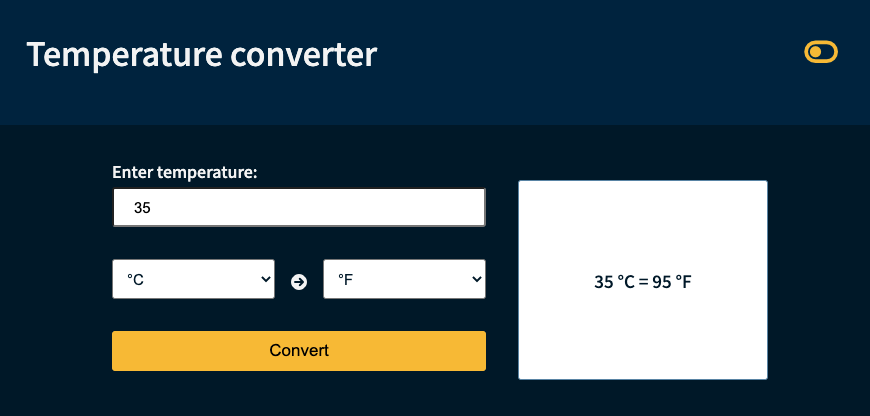

# Temperature converter

A simple application which takes the temperature in Celcius as input, converts it to Farenheit, and can also convert it from Fahrenheit to Celcius.  
<p align="center"> 
<a href=""></a>  
</p>  

## Notes

# Architecture  
- All the subcomponents are built dynamically so that they can be reused for other types of conversion, or other components, so that the app can be developped into a bigger project.  
# Design  
- The design is very simple and practical, so that it's customizable into other components. I used CSS for styling without the use of UI libraries, in order to be in control of the customizability.  
- The only concesions to styling are some font awesome icons.
- The color pallette is simple, using shades of blue and yellow for a contrast pop.
- Small but responsive.  
<p align="center"> 
<a href=""></a>  
</p>  

# Logic   
- The conversion result is displayed in a box, and it provides not only the result of the conversion, but also the input temperature and the units of conversion. 
- The conversion result is given as a round number, no decimals, intended for a user who wants only a quick check of the temperature and is not looking for high precision.
- The same box displays messages for the user, in case the temperature or the units are not properly selected.  
<p align="center"> 
<a href=""></a>  
</p>  

# Light
- A toggle icon on the top right corner can be clicked to render the display in light or dark mode; the default mode is light.  
<p align="center"> 
<a href=""></a>  
</p>  
 
# Built with  

- [Vue 3](https://vuejs.org/) in [Vite](https://vitejs.dev/)  
- Hosted on [Vercel](https://temperature-converter-seven.vercel.app/).  

### Project Setup

```sh
npm install
```  

### Compile

```sh
npm run build
```  

### Compile and Hot-Reload for Development

```sh
npm run dev
```  